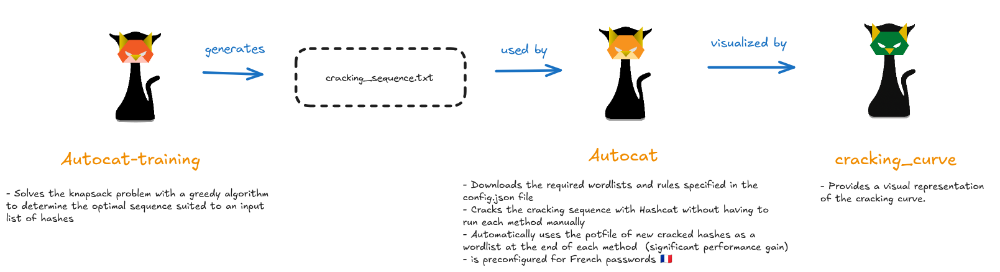
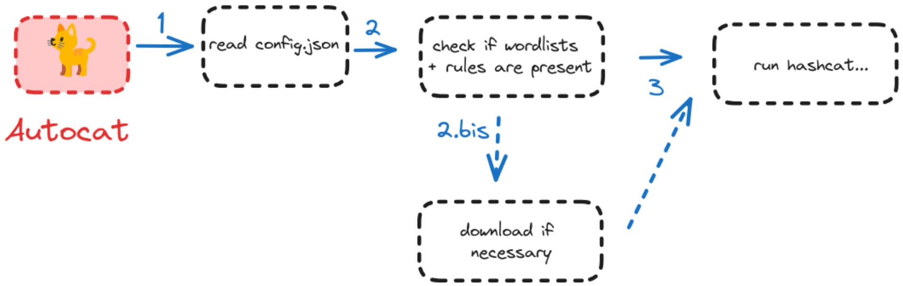

# Autocat - Intelligent Hashcat Automation Tool

<p align="center">
    
</p>

## Overview

Autocat is a wrapper for Hashcat that makes it easy to crack a cracking sequence without having to run each cracking method (wordlist with rules, brute-force) manually. Optimizations such as using the potfile of newly cracked passwords as wordlists provide significant performance gains.

Autocat comes pre-configured for French🇫🇷 passwords: the cracking sequence in `fr_cracking_sequence.txt` was produced by Autocat‑training: a large 2023 benchmark executed against an extensive dataset of French hashes aggregated from multiple sources, but you can set whatever sequence you want (for example for other languages) in the `cracking_sequence` field of the `config.json` file.

> [!NOTE]
> The technical explanations in the [Autocat-training](https://github.com/k4amos/Autocat-training) project's README provide a better understanding of the tool and the theory behind it.

<p align="center">
    
</p>
<br>

General architecture of Autocat :

<p align="center">
    
</p>
<br>

## Installation

1. Clone the repository:
```bash
git clone https://github.com/k4amos/Autocat
cd Autocat
```

2. Make the script executable:
```bash
chmod +x autocat.sh
```

## Usage

Autocat uses the same syntax as Hashcat. The attack mode (`-a` option) is handled automatically based on the cracking sequence. You don't need to specify the cracking method used (wordlist, rules, brute-force), as it is chosen automatically.

### Basic Usage

```bash
./autocat.sh -m [hash_type] [hash_file]
```

### Examples

Crack NTLM hashes:
```bash
./autocat.sh -m 1000 hashes.txt
```

### French🇫🇷 hash cracking

Here is the list of rules and wordlists required by Autocat to crack French hashes, as defined in `config.json`, which are automatically downloaded if missing:

| Wordlist  | Rules |
| ------------- | ------------- |
| clem9669_wordlists  | clem9669_rules  |
|  | Hob0Rules  |
|  | OneRuleToRuleThemAll |

The wordlists come from this [repository](https://github.com/clem9669/wordlists) which was forked to prevent a change to the wordlists' structure from breaking the tool.

### Other🌎 hash cracking

If you want to use other wordlists and rules, you can add them in the download_resources field of `config.json`.
If these resources are already present on your computer and you don’t need to download them, the simplest way is to add their paths to the respective lists `additional_rules_path` and `additional_wordlists_path` in `config.json`.


## Configuration

### config.json

The configuration file defines paths to resources.

You can modify these paths to point to existing wordlist collections on your system.

### cracking_sequence.txt

This file defines the attack sequence for french🇫🇷 password. Each line specifies an attack type.

## Other Tools

- [Autocat-training](https://github.com/k4amos/Autocat-training) : Autocat-training aims to solve the **knapsack problem** using a **greedy algorithm** to determine the **most optimal password cracking sequence** for cracking a given input list of hashes and a list of cracking methods (wordlists, rules, brute-force) that you can specify.
- [cracking_curve](https://github.com/k4amos/cracking_curve) : This tool makes it easy to display the cracking curve obtained with Hashcat/Autocat.

## Disclaimer

> [!CAUTION]
> This tool is provided for educational and authorized security testing purposes only. Users are responsible for complying with all applicable laws and regulations. The authors assume no liability for misuse or damage caused by this tool.
